# OpenShift Architecture Diagram

## Overview

This document provides a beginner-friendly architecture diagram that explains how the major components and services of OpenShift work together. OpenShift is a container application platform built on Kubernetes that provides additional features for development, deployment, and operations.

## Architecture Diagram

```mermaid
graph TB
    subgraph "User & Application Layer"
        Users[👥 Users<br/>Developers, Operators, End Users]
        CLI[🖥️ OpenShift CLI<br/>oc command-line tool]
        WebConsole[🌐 Web Console<br/>Browser-based UI]
        Apps[📱 Applications<br/>Microservices, APIs, Web Apps]
    end

    subgraph "Application Platform Layer - OpenShift"
        subgraph "Compute & Orchestration"
            Pods[📦 Pods<br/>Smallest deployable units<br/>Contain one or more containers]
            Nodes[🖥️ Nodes<br/>Worker machines<br/>Run container workloads]
            Operators[⚙️ Operators<br/>Automated cluster management<br/>Lifecycle management]
            Deployments[🚀 Deployments<br/>Manage pod replicas<br/>Rolling updates]
        end

        subgraph "Networking"
            Routes[🛣️ Routes<br/>External access to services<br/>URL-based routing]
            Services[🔗 Services<br/>Internal service discovery<br/>Load balancing]
            Ingress[🚪 Ingress<br/>HTTP/HTTPS routing rules]
            SDN[🌐 Software-Defined Network<br/>Pod-to-pod communication<br/>Network policies]
        end

        subgraph "Storage"
            PV[💾 Persistent Volumes<br/>Long-term data storage]
            PVC[📋 Persistent Volume Claims<br/>Storage requests from pods]
            StorageClasses[🗂️ Storage Classes<br/>Storage provisioning profiles]
        end

        subgraph "Security & Access Control"
            RBAC[🔐 RBAC<br/>Role-Based Access Control<br/>Permissions management]
            ServiceAccounts[👤 Service Accounts<br/>Identity for pods]
            Secrets[🔑 Secrets<br/>Sensitive data storage<br/>Passwords, tokens, keys]
            SCC[🛡️ Security Context Constraints<br/>Pod security policies]
        end

        subgraph "Build & CI/CD"
            Builds[🔨 Builds<br/>Source-to-image<br/>Docker builds]
            BuildConfigs[📝 Build Configs<br/>Build definitions<br/>Triggers]
            Pipelines[⚡ Pipelines<br/>CI/CD workflows<br/>Tekton-based]
            ImageStreams[🖼️ Image Streams<br/>Container image management<br/>Image registry]
        end

        subgraph "Monitoring & Observability"
            Metrics[📊 Metrics<br/>Resource usage<br/>Performance data]
            Logs[📝 Logs<br/>Application logs<br/>Container logs]
            Events[📅 Events<br/>Cluster events<br/>Status changes]
            Alerting[🚨 Alerting<br/>Threshold-based alerts]
        end

        subgraph "Configuration & Management"
            ConfigMaps[⚙️ ConfigMaps<br/>Configuration data<br/>Non-sensitive settings]
            Secrets2[🔑 Secrets<br/>Sensitive configuration]
            Projects[📁 Projects<br/>Resource isolation<br/>Namespace grouping]
            Templates[📋 Templates<br/>Reusable app definitions]
        end
    end

    subgraph "Infrastructure Layer"
        MasterNodes[🎯 Master Nodes<br/>Control plane<br/>API server, etcd, scheduler]
        WorkerNodes[⚙️ Worker Nodes<br/>Compute resources<br/>Container runtime]
        Registry[📦 Container Registry<br/>Image storage<br/>Internal registry]
        StorageBackend[💿 Storage Backend<br/>NFS, Ceph, AWS EBS<br/>External storage systems]
    end

    subgraph "External Systems"
        GitRepo[📚 Git Repository<br/>Source code<br/>Version control]
        ExternalRegistry[🌍 External Registry<br/>Docker Hub, Quay.io<br/>Public/private registries]
        CloudServices[☁️ Cloud Services<br/>AWS, Azure, GCP<br/>External integrations]
        MonitoringTools[📈 Monitoring Tools<br/>Prometheus, Grafana<br/>External observability]
    end

    %% User interactions
    Users --> CLI
    Users --> WebConsole
    CLI --> MasterNodes
    WebConsole --> MasterNodes

    %% Application deployment flow
    Apps --> Pods
    Apps --> Deployments
    Deployments --> Pods
    Pods --> Nodes
    Nodes --> WorkerNodes

    %% Networking flow
    Users --> Routes
    Routes --> Services
    Services --> Pods
    Ingress --> Services
    Pods --> SDN
    SDN --> Pods

    %% Storage flow
    Pods --> PVC
    PVC --> PV
    PV --> StorageClasses
    StorageClasses --> StorageBackend

    %% Security flow
    Users --> RBAC
    Pods --> ServiceAccounts
    ServiceAccounts --> RBAC
    Pods --> Secrets
    Pods --> SCC

    %% Build and CI/CD flow
    GitRepo --> BuildConfigs
    BuildConfigs --> Builds
    Builds --> ImageStreams
    ImageStreams --> Registry
    Pipelines --> Builds
    Pipelines --> Deployments
    ExternalRegistry --> ImageStreams

    %% Configuration flow
    Pods --> ConfigMaps
    Pods --> Secrets2
    Projects --> Pods
    Templates --> Deployments

    %% Monitoring flow
    Pods --> Metrics
    Pods --> Logs
    MasterNodes --> Events
    Metrics --> MonitoringTools
    Logs --> MonitoringTools

    %% Infrastructure connections
    MasterNodes --> WorkerNodes
    MasterNodes --> Registry
    Operators --> MasterNodes
    Operators --> WorkerNodes

    %% External integrations
    CloudServices --> StorageBackend
    CloudServices --> WorkerNodes

    style Users fill:#e1f5ff
    style Apps fill:#e1f5ff
    style Pods fill:#fff4e1
    style Nodes fill:#fff4e1
    style Routes fill:#e8f5e9
    style Services fill:#e8f5e9
    style PV fill:#f3e5f5
    style RBAC fill:#ffebee
    style Builds fill:#e0f2f1
    style Pipelines fill:#e0f2f1
    style MasterNodes fill:#fce4ec
    style WorkerNodes fill:#fce4ec
```

## Architecture Layers Explained

### 1. User & Application Layer
This is the top layer where users interact with OpenShift and where applications run:
- **Users**: Developers, operators, and end users who interact with the platform
- **CLI (oc)**: Command-line interface for managing OpenShift resources
- **Web Console**: Browser-based graphical interface for managing and monitoring
- **Applications**: Your actual workloads (microservices, web apps, APIs)

### 2. Application Platform Layer - OpenShift

This is the core OpenShift platform, organized into functional groups:

#### Compute & Orchestration
- **Pods**: The smallest deployable units containing one or more containers
- **Nodes**: Worker machines that run your container workloads
- **Operators**: Automated software that manages cluster components and applications
- **Deployments**: Controllers that manage pod replicas and handle updates

#### Networking
- **Routes**: Provide external URLs to access services from outside the cluster
- **Services**: Internal networking that enables pods to find and communicate with each other
- **Ingress**: HTTP/HTTPS routing rules for external traffic
- **SDN (Software-Defined Network)**: Handles pod-to-pod communication and network policies

#### Storage
- **Persistent Volumes (PV)**: Long-term storage that persists beyond pod lifecycles
- **Persistent Volume Claims (PVC)**: Requests for storage made by pods
- **Storage Classes**: Define different types of storage (fast SSD, slow HDD, etc.)

#### Security & Access Control
- **RBAC**: Role-Based Access Control manages who can do what in the cluster
- **Service Accounts**: Provide identity for pods to access cluster resources
- **Secrets**: Securely store sensitive data like passwords and API keys
- **SCC (Security Context Constraints)**: Define security policies for pods

#### Build & CI/CD
- **Builds**: Transform source code into container images
- **Build Configs**: Define how builds should happen and what triggers them
- **Pipelines**: Automated CI/CD workflows using Tekton
- **Image Streams**: Manage container images and track image versions

#### Monitoring & Observability
- **Metrics**: Collect resource usage and performance data
- **Logs**: Application and container logs for debugging
- **Events**: Track important changes and status updates in the cluster
- **Alerting**: Notify when thresholds are exceeded

#### Configuration & Management
- **ConfigMaps**: Store non-sensitive configuration data
- **Secrets**: Store sensitive configuration
- **Projects**: Organize and isolate resources (like folders)
- **Templates**: Reusable application definitions

### 3. Infrastructure Layer
The underlying infrastructure that powers OpenShift:
- **Master Nodes**: Control plane that manages the cluster (API server, etcd, scheduler)
- **Worker Nodes**: Machines that run your container workloads
- **Container Registry**: Stores built container images
- **Storage Backend**: External storage systems (NFS, cloud storage, etc.)

### 4. External Systems
Systems outside OpenShift that integrate with it:
- **Git Repository**: Source code version control
- **External Registry**: Public or private container registries
- **Cloud Services**: AWS, Azure, GCP integrations
- **Monitoring Tools**: External observability platforms

## Key Data Flows

### Application Deployment Flow
1. Developer pushes code to **Git Repository**
2. **Build Config** triggers a **Build** process
3. **Build** creates a container image and pushes to **Image Stream**
4. Image is stored in **Container Registry**
5. **Deployment** pulls image and creates **Pods** on **Worker Nodes**
6. **Routes** expose the application to users

### Request Flow
1. **User** makes request via browser/API
2. Request hits **Route** (external URL)
3. **Route** forwards to **Service**
4. **Service** load balances to appropriate **Pods**
5. **Pods** process request and return response

### Storage Flow
1. **Pod** needs storage, creates **Persistent Volume Claim**
2. **Storage Class** provisions a **Persistent Volume**
3. **Persistent Volume** connects to **Storage Backend**
4. **Pod** mounts the volume and can read/write data

### Security Flow
1. **User** authenticates and receives permissions via **RBAC**
2. **Pod** runs with a **Service Account** identity
3. **Service Account** has permissions defined in **RBAC**
4. **Pod** can access **Secrets** and other resources based on permissions
5. **Security Context Constraints** enforce security policies on pods

## Common Workload Patterns

### Microservices Architecture
- Multiple **Pods** running different services
- **Services** enable service-to-service communication
- **Routes** expose APIs to external users
- **ConfigMaps** and **Secrets** manage configuration

### Stateful Applications
- **Pods** with **Persistent Volume Claims** for database storage
- **StatefulSets** (not shown but similar to Deployments) manage stateful pods
- **Storage Classes** provide appropriate storage types

### CI/CD Pipeline
- **Git Repository** triggers **Pipelines**
- **Pipelines** run **Builds** to create images
- **Pipelines** deploy to different environments
- **Image Streams** track image versions

## Benefits of This Architecture

1. **Scalability**: Easily scale applications up or down by adjusting pod replicas
2. **High Availability**: Pods can be distributed across multiple nodes
3. **Automation**: Operators and controllers handle routine management tasks
4. **Security**: Multiple layers of security (RBAC, SCC, Secrets)
5. **Developer Experience**: Simple deployment process with powerful capabilities
6. **Observability**: Built-in monitoring, logging, and metrics
7. **Flexibility**: Supports various workloads from stateless web apps to stateful databases

## Next Steps

- Learn about [OpenShift Concepts](https://docs.openshift.com/)
- Explore the [Web Console](https://docs.openshift.com/container-platform/latest/web_console/web-console.html)
- Practice with the [OpenShift CLI](https://docs.openshift.com/container-platform/latest/cli_reference/openshift_cli/getting-started-cli.html)
- Understand [Kubernetes Fundamentals](https://kubernetes.io/docs/concepts/) (OpenShift is built on Kubernetes)

## Related Documentation

- [OpenShift Official Documentation](https://docs.openshift.com/)
- [Kubernetes Documentation](https://kubernetes.io/docs/)
- [OpenShift Architecture Guide](ARCHITECTURE.md) - CI-Tools specific architecture

