# Cloud Platforms Architecture: AWS, GCP, and Azure

## Overview

This diagram provides a beginner-friendly view of how the major cloud platforms (AWS, GCP, and Azure) are structured and how their services work together. The architecture is organized into logical layers that show the flow from users and applications down to the underlying infrastructure.

## Architecture Diagram

```mermaid
graph TB
    subgraph "User & Application Layer"
        Users[👥 Users]
        WebApp[🌐 Web Applications]
        MobileApp[📱 Mobile Apps]
        API[🔌 APIs]
    end

    subgraph "AWS - Amazon Web Services"
        subgraph "AWS Compute"
            EC2[EC2<br/>Virtual Servers]
            Lambda[Lambda<br/>Serverless Functions]
            ECS[ECS/EKS<br/>Container Services]
        end
        
        subgraph "AWS Networking"
            VPC[VPC<br/>Virtual Network]
            ALB[ALB/NLB<br/>Load Balancers]
            APIGW[API Gateway<br/>API Management]
            CloudFront[CloudFront<br/>CDN]
        end
        
        subgraph "AWS Storage"
            S3[S3<br/>Object Storage]
            EBS[EBS<br/>Block Storage]
            RDS[RDS<br/>Managed Databases]
            DynamoDB[DynamoDB<br/>NoSQL Database]
        end
        
        subgraph "AWS Security"
            IAM[IAM<br/>Identity & Access]
            KMS[KMS<br/>Key Management]
            WAF[WAF<br/>Web Firewall]
        end
        
        subgraph "AWS Operations"
            CloudWatch[CloudWatch<br/>Monitoring]
            CloudTrail[CloudTrail<br/>Audit Logging]
            CodePipeline[CodePipeline<br/>CI/CD]
        end
    end

    subgraph "GCP - Google Cloud Platform"
        subgraph "GCP Compute"
            GCE[Compute Engine<br/>Virtual Machines]
            CloudFunctions[Cloud Functions<br/>Serverless]
            GKE[GKE<br/>Kubernetes Engine]
            CloudRun[Cloud Run<br/>Serverless Containers]
        end
        
        subgraph "GCP Networking"
            VPC_GCP[VPC<br/>Virtual Network]
            LoadBalancer[Cloud Load Balancing<br/>Traffic Distribution]
            CloudEndpoints[Cloud Endpoints<br/>API Management]
            CloudCDN[Cloud CDN<br/>Content Delivery]
        end
        
        subgraph "GCP Storage"
            CloudStorage[Cloud Storage<br/>Object Storage]
            PersistentDisk[Persistent Disk<br/>Block Storage]
            CloudSQL[Cloud SQL<br/>Managed Databases]
            Firestore[Firestore<br/>NoSQL Database]
        end
        
        subgraph "GCP Security"
            IAM_GCP[Cloud IAM<br/>Identity & Access]
            KMS_GCP[Cloud KMS<br/>Key Management]
            CloudArmor[Cloud Armor<br/>DDoS Protection]
        end
        
        subgraph "GCP Operations"
            Monitoring[Cloud Monitoring<br/>Metrics & Alerts]
            Logging[Cloud Logging<br/>Centralized Logs]
            CloudBuild[Cloud Build<br/>CI/CD]
        end
    end

    subgraph "Azure - Microsoft Azure"
        subgraph "Azure Compute"
            VMs[Virtual Machines<br/>VMs]
            Functions[Azure Functions<br/>Serverless]
            AKS[AKS<br/>Kubernetes Service]
            AppService[App Service<br/>Web Apps]
        end
        
        subgraph "Azure Networking"
            VNet[Virtual Network<br/>VNet]
            LoadBalancer_AZ[Load Balancer<br/>Traffic Management]
            APIManagement[API Management<br/>API Gateway]
            FrontDoor[Azure Front Door<br/>CDN & WAF]
        end
        
        subgraph "Azure Storage"
            BlobStorage[Blob Storage<br/>Object Storage]
            ManagedDisks[Managed Disks<br/>Block Storage]
            SQLDatabase[Azure SQL<br/>Managed Database]
            CosmosDB[Cosmos DB<br/>NoSQL Database]
        end
        
        subgraph "Azure Security"
            AzureAD[Azure AD<br/>Identity & Access]
            KeyVault[Key Vault<br/>Secrets Management]
            Firewall[Azure Firewall<br/>Network Security]
        end
        
        subgraph "Azure Operations"
            Monitor[Azure Monitor<br/>Observability]
            LogAnalytics[Log Analytics<br/>Log Management]
            DevOps[Azure DevOps<br/>CI/CD]
        end
    end

    subgraph "Infrastructure Layer"
        DataCenters[🏢 Data Centers<br/>Physical Infrastructure]
        Regions[🌍 Regions & Zones<br/>Geographic Distribution]
    end

    %% User to Platform connections
    Users --> WebApp
    Users --> MobileApp
    WebApp --> API
    MobileApp --> API

    %% AWS connections
    API --> APIGW
    APIGW --> ALB
    ALB --> EC2
    ALB --> ECS
    APIGW --> Lambda
    EC2 --> VPC
    ECS --> VPC
    Lambda --> VPC
    EC2 --> EBS
    EC2 --> S3
    ECS --> RDS
    Lambda --> DynamoDB
    CloudFront --> S3
    EC2 --> IAM
    Lambda --> IAM
    S3 --> KMS
    RDS --> KMS
    ALB --> WAF
    EC2 --> CloudWatch
    Lambda --> CloudWatch
    S3 --> CloudTrail
    CodePipeline --> EC2
    CodePipeline --> ECS

    %% GCP connections
    API --> CloudEndpoints
    CloudEndpoints --> LoadBalancer
    LoadBalancer --> GCE
    LoadBalancer --> GKE
    LoadBalancer --> CloudRun
    CloudEndpoints --> CloudFunctions
    GCE --> VPC_GCP
    GKE --> VPC_GCP
    CloudRun --> VPC_GCP
    CloudFunctions --> VPC_GCP
    GCE --> PersistentDisk
    GCE --> CloudStorage
    GKE --> CloudSQL
    CloudFunctions --> Firestore
    CloudCDN --> CloudStorage
    GCE --> IAM_GCP
    CloudFunctions --> IAM_GCP
    CloudStorage --> KMS_GCP
    CloudSQL --> KMS_GCP
    LoadBalancer --> CloudArmor
    GCE --> Monitoring
    CloudFunctions --> Monitoring
    CloudStorage --> Logging
    CloudBuild --> GKE
    CloudBuild --> CloudRun

    %% Azure connections
    API --> APIManagement
    APIManagement --> LoadBalancer_AZ
    LoadBalancer_AZ --> VMs
    LoadBalancer_AZ --> AKS
    LoadBalancer_AZ --> AppService
    APIManagement --> Functions
    VMs --> VNet
    AKS --> VNet
    AppService --> VNet
    Functions --> VNet
    VMs --> ManagedDisks
    VMs --> BlobStorage
    AKS --> SQLDatabase
    Functions --> CosmosDB
    FrontDoor --> BlobStorage
    VMs --> AzureAD
    Functions --> AzureAD
    BlobStorage --> KeyVault
    SQLDatabase --> KeyVault
    LoadBalancer_AZ --> Firewall
    VMs --> Monitor
    Functions --> Monitor
    BlobStorage --> LogAnalytics
    DevOps --> AKS
    DevOps --> AppService

    %% Infrastructure connections
    EC2 --> DataCenters
    GCE --> DataCenters
    VMs --> DataCenters
    VPC --> Regions
    VPC_GCP --> Regions
    VNet --> Regions

    style Users fill:#e1f5ff
    style WebApp fill:#e1f5ff
    style MobileApp fill:#e1f5ff
    style API fill:#e1f5ff
    style EC2 fill:#ff9900
    style Lambda fill:#ff9900
    style S3 fill:#ff9900
    style RDS fill:#ff9900
    style IAM fill:#ff9900
    style CloudWatch fill:#ff9900
    style GCE fill:#4285f4
    style CloudFunctions fill:#4285f4
    style CloudStorage fill:#4285f4
    style CloudSQL fill:#4285f4
    style IAM_GCP fill:#4285f4
    style Monitoring fill:#4285f4
    style VMs fill:#0078d4
    style Functions fill:#0078d4
    style BlobStorage fill:#0078d4
    style SQLDatabase fill:#0078d4
    style AzureAD fill:#0078d4
    style Monitor fill:#0078d4
    style DataCenters fill:#f0f0f0
    style Regions fill:#f0f0f0
```

## Architecture Layers Explained

### 1. User & Application Layer
This is where end users interact with applications through web browsers, mobile apps, or API clients. Applications at this layer make requests to backend services hosted in the cloud.

### 2. Compute Layer
**Purpose**: Provides the processing power to run applications and services.

- **AWS**: EC2 (virtual servers), Lambda (serverless), ECS/EKS (containers)
- **GCP**: Compute Engine (VMs), Cloud Functions (serverless), GKE (Kubernetes), Cloud Run (serverless containers)
- **Azure**: Virtual Machines, Azure Functions (serverless), AKS (Kubernetes), App Service (web apps)

**How it works**: Applications are deployed to these compute resources, which can scale up or down based on demand.

### 3. Networking Layer
**Purpose**: Connects services, routes traffic, and provides secure communication.

- **AWS**: VPC (isolated networks), ALB/NLB (load balancing), API Gateway, CloudFront (CDN)
- **GCP**: VPC (networks), Cloud Load Balancing, Cloud Endpoints, Cloud CDN
- **Azure**: Virtual Network (VNet), Load Balancer, API Management, Azure Front Door

**How it works**: Traffic flows from users through load balancers and API gateways to the appropriate compute resources. CDNs cache content closer to users for faster delivery.

### 4. Storage Layer
**Purpose**: Stores data persistently for applications and users.

- **AWS**: S3 (object storage), EBS (block storage), RDS (SQL databases), DynamoDB (NoSQL)
- **GCP**: Cloud Storage (object), Persistent Disk (block), Cloud SQL (SQL), Firestore (NoSQL)
- **Azure**: Blob Storage (object), Managed Disks (block), Azure SQL (SQL), Cosmos DB (NoSQL)

**How it works**: Applications read and write data to storage services. Object storage is for files, block storage is for databases, and managed databases handle SQL/NoSQL operations.

### 5. Security Layer
**Purpose**: Protects resources, manages access, and encrypts data.

- **AWS**: IAM (access control), KMS (encryption keys), WAF (web firewall)
- **GCP**: Cloud IAM (access control), Cloud KMS (encryption), Cloud Armor (DDoS protection)
- **Azure**: Azure AD (identity), Key Vault (secrets), Azure Firewall

**How it works**: IAM/AD controls who can access what resources. KMS/Key Vault manages encryption keys. Firewalls protect against attacks.

### 6. Operations Layer
**Purpose**: Monitors system health, logs events, and automates deployments.

- **AWS**: CloudWatch (monitoring), CloudTrail (audit logs), CodePipeline (CI/CD)
- **GCP**: Cloud Monitoring (metrics), Cloud Logging (logs), Cloud Build (CI/CD)
- **Azure**: Azure Monitor (observability), Log Analytics (logs), Azure DevOps (CI/CD)

**How it works**: Monitoring tracks performance and alerts on issues. Logging records events for troubleshooting. CI/CD pipelines automate building, testing, and deploying applications.

### 7. Infrastructure Layer
**Purpose**: The physical foundation - data centers and geographic regions.

**How it works**: All cloud services run on physical servers in data centers distributed across multiple geographic regions and availability zones for redundancy and low latency.

## Key Data Flows

### 1. User Request Flow
1. User makes a request through a web or mobile app
2. Request goes through API Gateway/Management service
3. Load balancer distributes traffic to available compute instances
4. Application processes the request, potentially accessing storage
5. Response flows back through the same path

### 2. Application Deployment Flow
1. Developer commits code to a repository
2. CI/CD pipeline (CodePipeline/Cloud Build/Azure DevOps) triggers
3. Pipeline builds the application, runs tests
4. If successful, deploys to compute resources (EC2/GCE/VMs or containers)
5. Monitoring services track the deployment health

### 3. Data Storage Flow
1. Application writes data to storage service (S3/Cloud Storage/Blob Storage)
2. Data is encrypted using keys from KMS/Key Vault
3. Data is replicated across multiple availability zones
4. Access is controlled through IAM policies
5. Logs of access are recorded in audit services (CloudTrail/Logging/Log Analytics)

### 4. Scaling Flow
1. Monitoring detects increased load (CPU, memory, requests)
2. Auto-scaling policies trigger new compute instances
3. Load balancer automatically includes new instances
4. Traffic is distributed across all instances
5. When load decreases, extra instances are terminated

## Common Use Cases

### Web Application
- **Frontend**: Served via CDN (CloudFront/Cloud CDN/Front Door)
- **Backend**: Runs on containers (ECS/GKE/AKS) or serverless (Lambda/Functions)
- **Database**: Managed database (RDS/Cloud SQL/Azure SQL)
- **Storage**: Object storage for user uploads (S3/Cloud Storage/Blob)

### Microservices Architecture
- **API Gateway**: Routes requests to appropriate services
- **Services**: Deployed as containers in orchestrated clusters
- **Service Discovery**: Built into container platforms
- **Monitoring**: Tracks health of each microservice

### Serverless Application
- **Functions**: Execute code without managing servers
- **Event Triggers**: Functions respond to events (HTTP, database changes, file uploads)
- **Auto-scaling**: Automatically scales from zero to thousands of instances
- **Pay-per-use**: Only pay for actual execution time

## Security Best Practices Shown

1. **Network Isolation**: VPCs/VNets create isolated network environments
2. **Identity Management**: IAM/Azure AD controls access to all resources
3. **Encryption**: KMS/Key Vault manages encryption keys for data at rest and in transit
4. **Firewalls**: WAF/Cloud Armor/Firewall protect against attacks
5. **Audit Logging**: CloudTrail/Logging/Log Analytics record all access for compliance

## Monitoring & Observability

All platforms provide:
- **Metrics**: CPU, memory, network, custom application metrics
- **Logs**: Centralized logging from all services
- **Alerts**: Notifications when thresholds are exceeded
- **Dashboards**: Visual representation of system health
- **Tracing**: Track requests across distributed systems

## Summary

This architecture shows how AWS, GCP, and Azure provide similar capabilities organized into layers:

1. **Users** interact with applications
2. **Applications** run on compute resources
3. **Networking** routes and balances traffic
4. **Storage** persists data
5. **Security** protects everything
6. **Operations** monitors and automates
7. **Infrastructure** provides the physical foundation

Each platform offers equivalent services with different names, but they all follow similar architectural patterns. The choice between platforms often depends on specific service features, pricing, geographic presence, and integration with existing tools.

